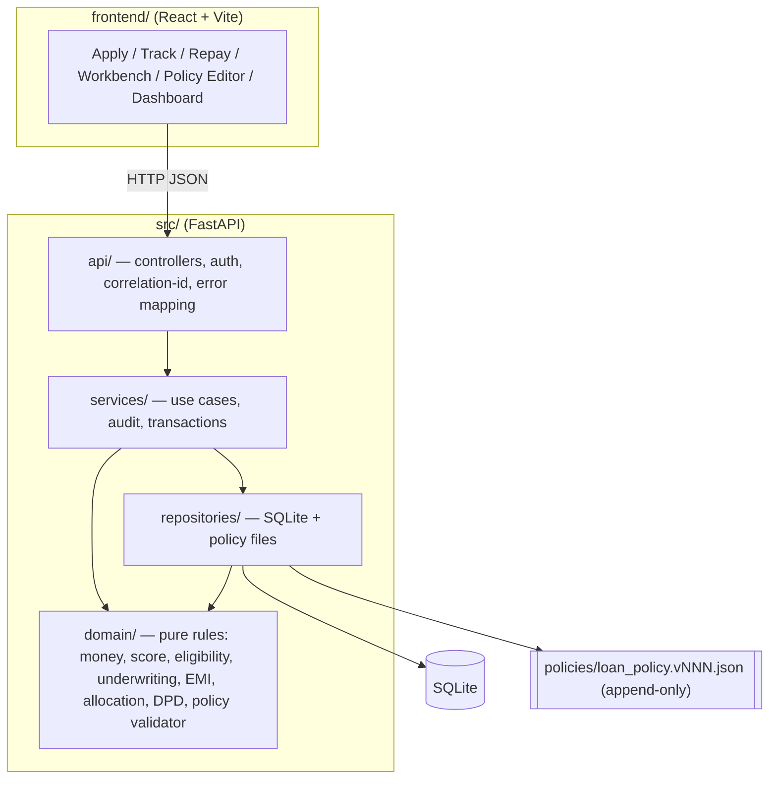
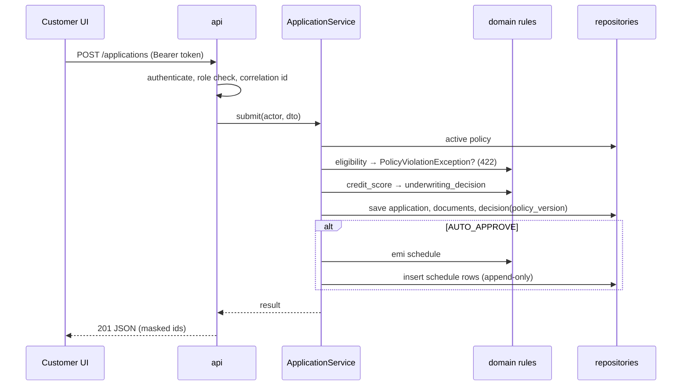

# Architecture
Layered monolith: **controllers (api) → services → repositories → domain**. Spec-driven; see `specs/app_spec.md`.

## Layering rules (enforced)
| Layer | May import | Must not import |
|---|---|---|
| `api` | `services`, `domain` types for DTO mapping only via services | `repositories`, `sqlite3` |
| `services` | `repositories`, `domain` | `api`, `fastapi` |
| `repositories` | `domain`, `sqlite3`, `json` | `services`, `api` |
| `domain` | stdlib (`decimal`, `dataclasses`, `enum`, `datetime` types) | any other project layer, `fastapi`, `sqlite3`, IO |

`.importlinter` (generated by an agent from this table): a `layers` contract `src.api | src.services | src.repositories | src.domain` and a `forbidden` contract for `src.domain` → `fastapi`, `sqlite3`. `tests/architecture/` repeats these as pytest tests so they run in the normal suite.

## Request flow — application submission

## Data model (SQLite, TEXT decimals)
`applications`, `documents`, `decisions`, `overrides`, `loans` (outstanding, bucket, dpd, total_payable), `repayment_schedule` (insert-only), `repayments`, `repayment_allocations` (insert-only), `disbursements`, `audit_log` (insert-only), `schema_migrations`. Policies live as files, not rows. Migrations are numbered SQL files applied in order.

## Cross-cutting
- **Auth:** controller dependency `require_role`; services receive `Actor`.
- **Audit:** services write `audit_log` for every underwriter/admin action.
- **Logging:** JSON formatter; `correlation_id` from `X-Correlation-ID` or generated; filter that drops sensitive fields.
- **Time:** `Clock` port injected; `FakeClock` in tests.
- **Health:** `/health` has no DB dependency beyond a trivial check; responds within 1 s of startup.

## Agent substrate
Harness agents (planner, generator, evaluator, security-reviewer, test-engineer, design-critic, ui-designer) plus project agents (`underwriting-agent`, `repayment-schedule-agent`, `policy-validator-agent`). Hooks guard immutability, money precision and PII logging. Playwright MCP is used by the evaluator for UI checks.
