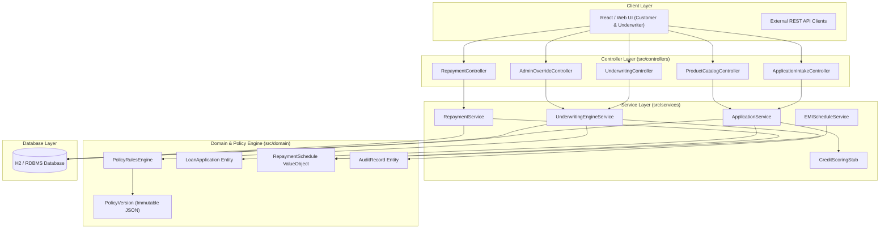
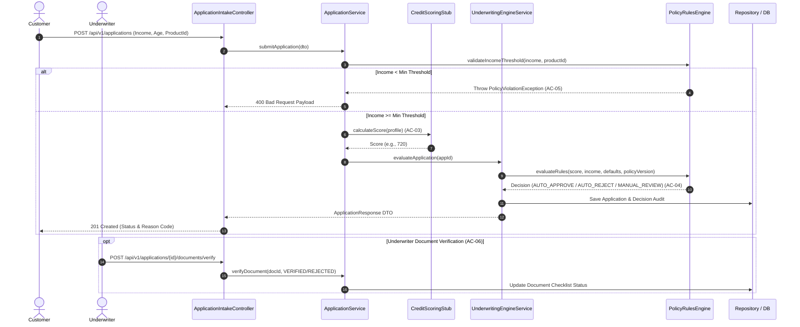

# Architecture Specification & Technical Design — TrueLend

> **System**: TrueLend Loan Origination & Underwriting System  
> **Pattern**: Layered Clean Architecture (Controllers -> Services -> Domain & Policy Engine)

---

## 1. High-Level Architectural Context & Layering

---

## 2. Underwriting Sequence Workflow

---

## 3. Structural Layering Constraints (ArchUnit Enforced)
1. **Domain Independence**: Classes in `src/domain/` MUST NOT depend on `src/controllers/`, Spring MVC, or UI layers.
2. **Controller Scope**: Controllers MUST ONLY invoke Service interface methods and return DTOs.
3. **Fixed-Point Financial Standard**: Monetary calculations MUST ONLY use `BigDecimal`. `double` and `float` types are forbidden in domain money fields.
4. **Immutability of Policy & Schedules**: Repayment schedules and Policy Versions are append-only. Entities mapped to DB tables `policy_versions` and `repayment_schedules` must not expose `UPDATE` or `DELETE` mutation endpoints.
